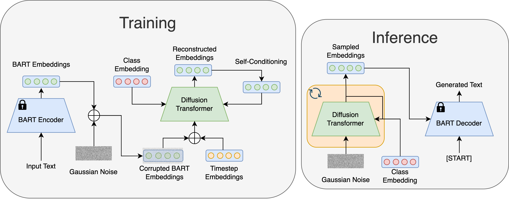

# Latent Diffusion for Language Generation

This is the official code release for

[**Latent Diffusion for Language Generation**](https://arxiv.org/abs/2212.09462).

by Justin Lovelace, Varsha Kishore, Chao Wan, Eliot Shekhtman, and Kilian Q. Weinberger




## Environment
A suitable environment can be created with the following commands. 
```bash
conda env create -f environment.yml
python -m spacy download en_core_web_sm
```

## Datasets

The dataset files for the E2E and ROCStories datasets are included in the `datasets/` directory and do not require any additional processing. The SST and AG News datasets are loaded from the HuggingFace Hub.

## Training

We provide scripts to train the diffusion models for each dataset with our default hyperparameters. Train a model with the command 
```bash
./scripts/diffusion/text_diffusion_{dataset}.sh
```
where dataset is one of `{roc, e2e, sst2, ag_news}`.

## Evaluation
To evaluate a trained model on the validation set, see the `scripts/diffusion/eval_text_diffusion.sh` script for an example. The `--resume_dir` argument should be updated with the path of a trained model. 


Different sampling configurations can be explored by changing the `{num_samples, sampling_timesteps, ddim_sampling_eta}` arguments. We utilize 1,000 random samples for computing the metrics in our work. Note that MAUVE scores computed with different numbers of samples are not directly comparable (see [here](https://github.com/krishnap25/mauve) for more information about MAUVE scores).

To evaluate a trained model on the test set with 5 random seeds, see the `scripts/diffusion/test_eval_text_diffusion.sh` script for an example. The only difference is that the `eval_test` flag is used instead of the `eval` flag. The `--resume_dir` argument will need to be updated as before.

## Contact
Please open an issue if you have any questions about using this repo. I will be updating the repo with the code for the classification experiment and the autoregressive baseline after the holiday season.


## Acknowledgement
This work built upon excellent open-source implementations from [Lucidrains](https://github.com/lucidrains). Specifically, we adapted his Pytorch DDPM implementation ([link](https://github.com/lucidrains/denoising-diffusion-pytorch)) and built upon his transformer implementation ([link](https://github.com/lucidrains/x-transformers)).